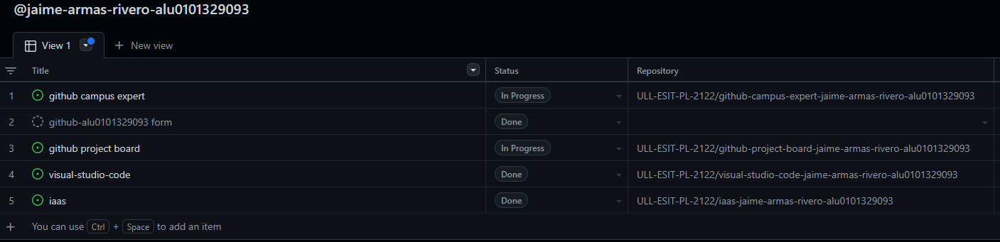
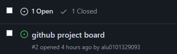

# github-project-board-jaime-armas-rivero-alu0101329093

## Explicaciones de las tareas

### Creado un projecto Kanban a nivel de organización para llevar el seguimiento de las prácticas

### Usar los project board kanban para informar del avances de cada prática

#### Ejemplo del repositorio `github-campus-expert-jaime-armas-rivero-alu0101329093`

#### Ejemplo del repositorio `visual-studio-code-jaime-armas-rivero-alu0101329093`

### Al conectar un tarea del kanban de la organización con un repositorio se crea una incidencia en este

